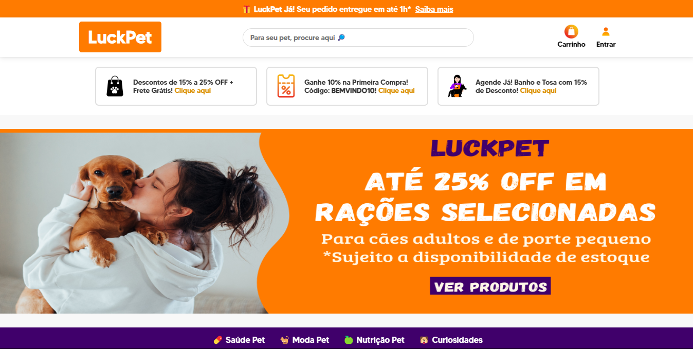

#  LuckPet - E-commerce para Pets

Um e-commerce moderno e responsivo para produtos pet, desenvolvido com HTML, CSS e JavaScript. Oferece navegação intuitiva, produtos exclusivos e curiosidades interativas.



## ✨ Funcionalidades

### 🛍️ Navegação e Produtos
- **Categorias organizadas**: Saúde, Moda, Nutrição e Curiosidades
- **Destaques**: 
  - Produto exclusivo *"Gato com Charme de Natal"* (óculos e cachecol)
  - Cards de produtos com hover effects
- **Design responsivo**: Adaptado para mobile, tablet e desktop

### 🐶 Interatividade
- **Área de curiosidades**: Informações dinâmicas ao passar o mouse
- **Interface intuitiva**: Transições suaves e feedback visual

## 🛠️ Stack Tecnológica

| Tecnologia | Função |
|------------|--------|
|  HTML | Estrutura do site |
|  CSS | Estilização e responsividade |
|  JavaScript | Lógica e interatividade |

## 🌐 Acesso Online
Escolha seu deploy preferido:
- **Vercel (recomendado)**: [projeto-luckpet.vercel.app](https://projeto-luckpet.vercel.app/)
- **GitHub Pages**: [pablog-7.github.io/ecommerce-luckpet](https://pablog-7.github.io/ecommerce-luckpet/)

## 🚀 Como Executar Localmente

```bash
# Clone o repositório
git clone https://github.com/pablog-7/ecommerce-luckpet.git

# Acesse a pasta do projeto
cd ecommerce-luckpet

# Abra no navegador (ou use um servidor local)
open index.html  # macOS
start index.html # Windows

```

## 🤝 Como Contribuir
Faça um Fork do projeto

Crie uma branch (git checkout -b feature/nova-feature)

Commit suas mudanças (git commit -m 'Adiciona recurso X')

Push para a branch (git push origin feature/nova-feature)

Abra um Pull Request

## 📄 Licença
Distribuído sob licença MIT. Veja LICENSE para mais informações.

